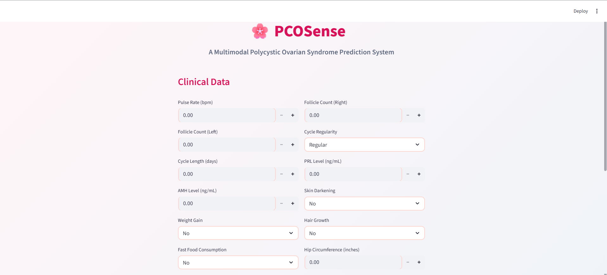
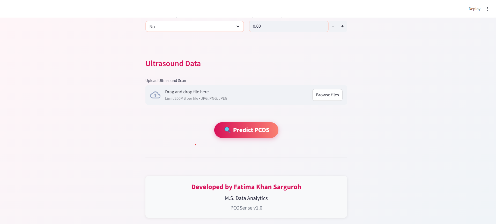
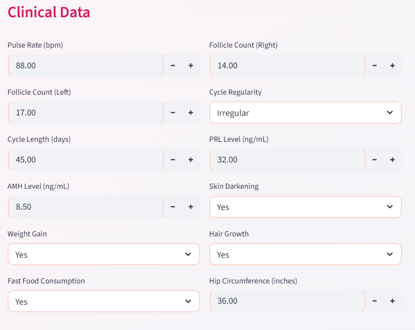
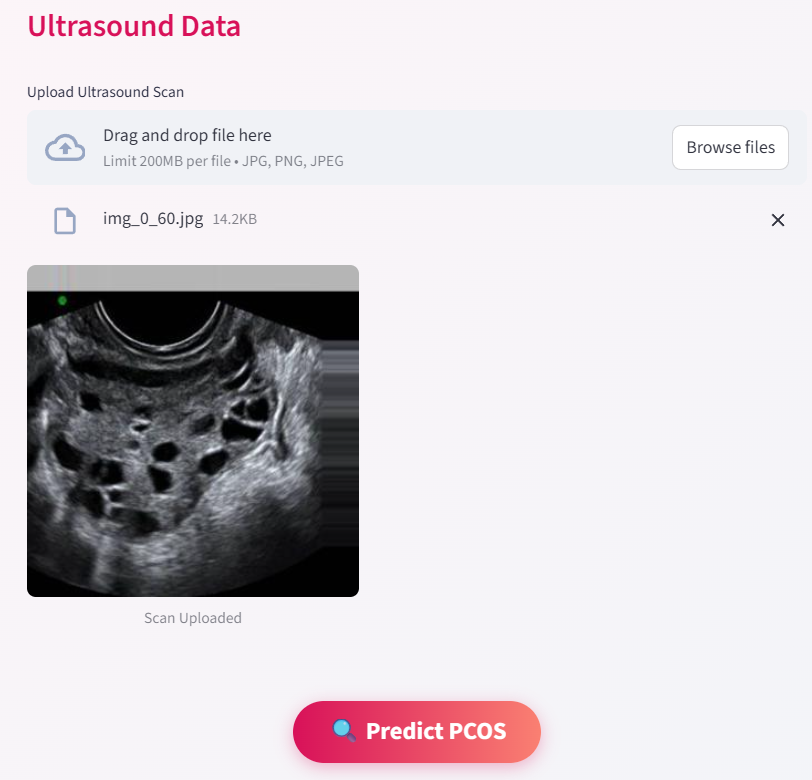
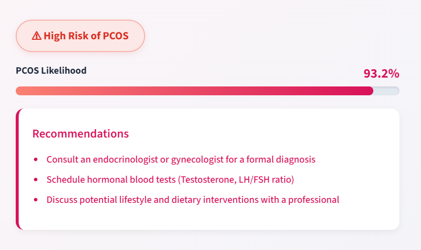
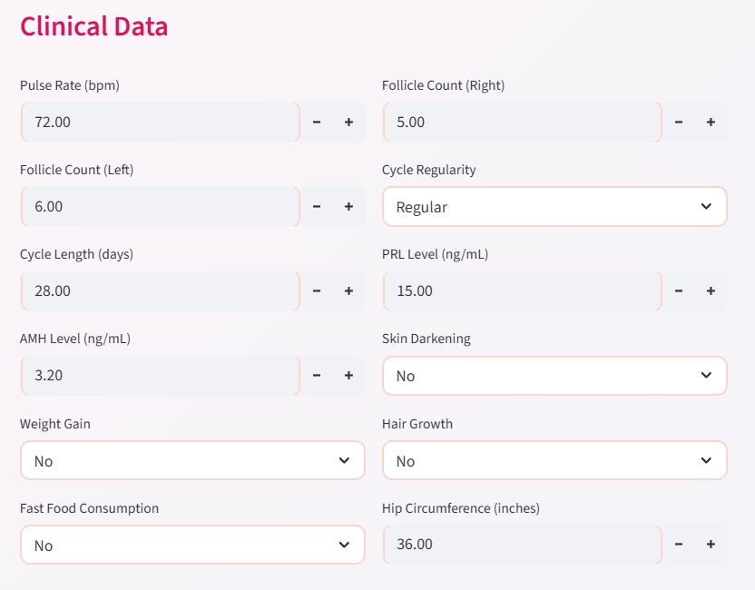
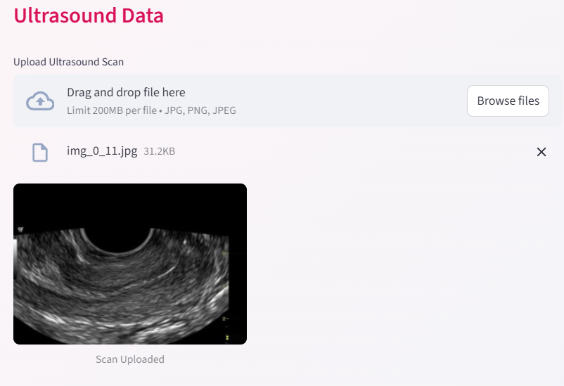
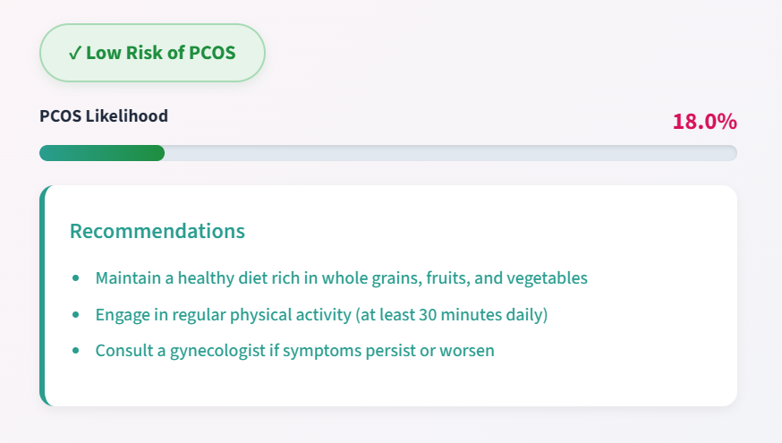

# PCOSENSE: A Multimodal Intelligent System for PCOS Detection

## Overview
PCOSENSE is an intelligent healthcare application developed to assist in the early detection of Polycystic Ovary Syndrome (PCOS) by combining clinical patient data and ultrasound image analysis. The system integrates machine learning and deep learning models using a decision-level fusion approach to improve diagnostic performance.

## Problem Statement
Polycystic Ovary Syndrome (PCOS) is one of the most common hormonal disorders affecting women of reproductive age. Traditional diagnosis often depends on either clinical examination or ultrasound imaging, which may lead to delayed or inconsistent diagnosis.
PCOSENSE addresses this challenge by combining both clinical parameters and ultrasound image analysis to provide a more comprehensive prediction.

## Objectives
- Detect PCOS using clinical and ultrasound data.
- Develop a multimodal prediction system using machine learning and deep learning.
- Build an interactive Streamlit application for easy prediction.
- Improve diagnostic accuracy through decision-level fusion.

## Technologies Used
- Python
- Jupyter Notebook
- Streamlit
- Pandas
- NumPy
- Scikit-learn
- TensorFlow
- Keras
- Matplotlib

## Machine Learning Models
- Random Forest
- Logistic Regression
- Gaussian Naive Bayes

## Deep Learning Model
- MobileNetV2
- Attention Mechanism
- Residual Blocks

## Project Workflow
1. Collect clinical patient data.
2. Upload ultrasound image.
3. Preprocess the input data.
4. Predict using machine learning model.
5. Predict using deep learning model.
6. Combine predictions using decision-level fusion.
7. Display the final PCOS prediction through the Streamlit application.

## Application Screenshots

### Clinical Data Input

### Ultrasound Upload

### Prediction Results

## Project Structure
PCOSENSE-PCOS-Detection/
│
├── README.md
├── app.py
├── PCOSENSE.ipynb
├── requirements.txt
├── .gitignore
├── images/
└── models/

## Future Enhancements
- Improve model interpretability using Explainable AI (XAI).
- Expand the dataset to improve model robustness.
- Integrate cloud-based deployment.
- Enhance the user interface for improved usability. 

## Author
*Fatima Khan*

M.S. Data Analytics

This project was developed as part of the M.Sc. Data Analytics programme and demonstrates the application of machine learning, deep learning, and data analytics techniques to support healthcare decision-making.
